# 지역 경제 활성 여행 사이트 Mapbius

## 1. 프로젝트 개요
### 1.1 프로젝트 배경
지역경제는 국가 경제에서 중요한 역할을 하며, 지속 가능한 성장을 위해 필수적인 요소입니다. 그러나 많은 지방 및 소도시가 인구 감소, 일자리 부족, 상권 침체 등 다양한 문제에 직면해 있습니다. 이에 따라, 지역 주민, 상인, 관광객들이 쉽게 정보를 공유하고 협력할 수 있는 디지털 플랫폼이 필요합니다.

본 프로젝트는 이러한 문제를 해결하고자 지역 정보 및 여행 관련 데이터를 제공하는 웹 플랫폼을 개발하여 지역경제 활성화를 돕는 것을 목표로 합니다.

### 1.2 프로젝트 목적
- 본 프로젝트의 주요 목적은 다음과 같습니다.
- 지방 및 소도시의 인구 감소 문제를 완화하고 경제 활성화에 기여
- 여행과 지역경제를 결합한 플랫폼을 통해 지역 방문객 유도
- 여행객에게 지역 정보 제공 및 편리한 탐색 환경 제공
- 방문객 증가를 통해 지역 내 상권 활성화 및 재방문율 향상
- 낯선 지역에 대한 진입 장벽을 낮추고 친근한 환경 조성

### 1.3 프로젝트 개요
맵비우스(Mapbius)는 사용자 친화적인 웹 기반 플랫폼으로, 여행객과 지역 주민이 쉽게 정보를 찾고 공유할 수 있도록 설계되었습니다. 본 프로젝트에서는 다음과 같은 주요 기능을 제공합니다.

- 직관적인 사용자 인터페이스(UI) 및 원활한 사용자 경험(UX) 제공
- 데이터베이스(MySQL) 기반의 사용자 리뷰, 즐겨찾기, 공지사항 관리
- Spring Boot 기반 서버 개발 및 React.js 프론트엔드 구현
- 카카오맵 API를 활용한 지도 서비스 제공 (경로 탐색, 지역 탐색, 마커 기능)
- 공공 API를 활용한 지역 정보 제공 (축제, 특산물, 인구수 등)
- 프로젝트 보고서: 맵비우스(Mapbius) 1
- JWT 기반 사용자 인증 및 보안 강화
- AI 챗봇 기능을 통한 맞춤형 여행 추천 및 상담

## 2. 프로젝트 요구사항
## 2.1 주요 기능
본 프로젝트에서 구현할 주요 기능은 다음과 같습니다.
1. 사용자 인터페이스 구축
- React.js 기반의 직관적이고 사용하기 쉬운 웹 인터페이스 설계
- 모바일 및 데스크톱 환경에서 최적화된 반응형 디자인 적용
2. 데이터베이스 연동 및 관리
- MySQL을 활용하여 사용자 리뷰, 즐겨찾기, 공지사항 데이터 관리
- 실시간 데이터 처리를 위한 효율적인 데이터베이스 설계
3. 서버 사이드 로직 개발
- Spring Boot를 활용한 API 및 비즈니스 로직 구현
- 클라이언트와 서버 간 원활한 데이터 통신을 위한 RESTful API 구축
4. 보안 및 인증 시스템
- JWT(JSON Web Token) 기반 사용자 인증 및 권한 관리
- 사용자 개인정보 보호 및 보안 강화
5. 공공 API 및 지도 서비스 연동
- 공공 데이터 API를 활용하여 지역 정보 제공
- 카카오맵 API를 이용한 경로 탐색, 지역 탐색, 마커 및 키워드 검색 기능 구현
6. AI 기반 채팅 기능
- 사용자 맞춤형 정보 제공을 위한 AI 챗봇 기능 추가
- 여행 추천, 일정 상담 등의 기능 지원
### 2.2 시스템 구성
본 프로젝트는 클라이언트-서버 아키텍처를 기반으로 구성됩니다.
- 프론트엔드: React.js를 사용하여 사용자 인터페이스(UI) 개발
- 백엔드: Spring Boot를 활용한 데이터 처리 및 API 제공
- 데이터베이스: MySQL을 사용하여 사용자 및 지역 정보를 저장 및 관리
- 인증 및 보안: JWT 기반 인증 시스템 적용
- 지도 서비스: 카카오맵 API를 활용한 경로 탐색 및 지역 정보 제공
- AI 기능: 챗봇을 통한 사용자 맞춤형 정보 제공

## 3. 사용기술
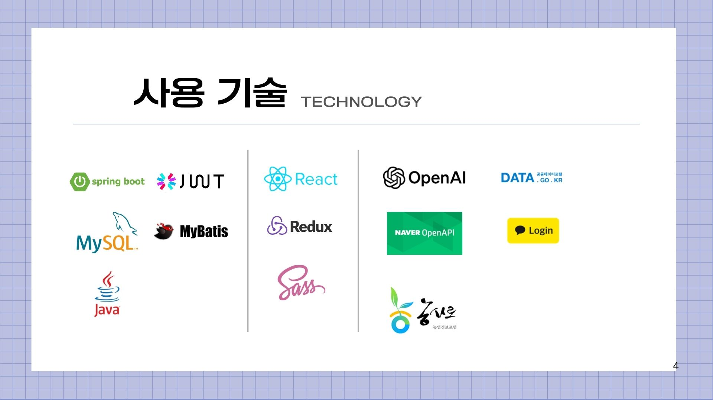

## 4. 사이트 화면
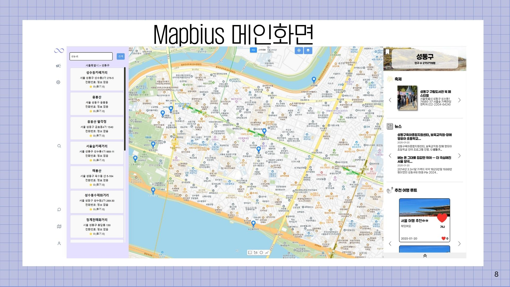
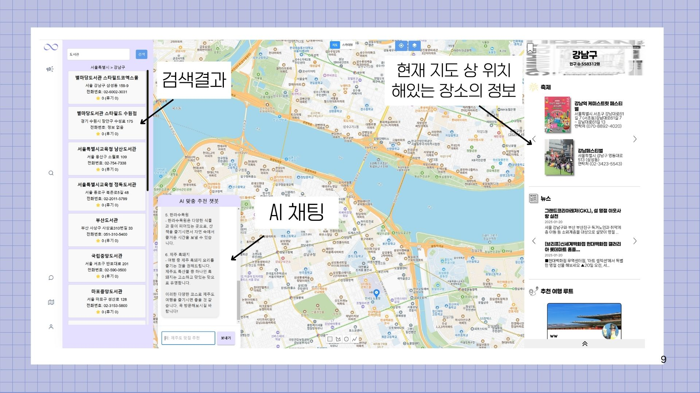
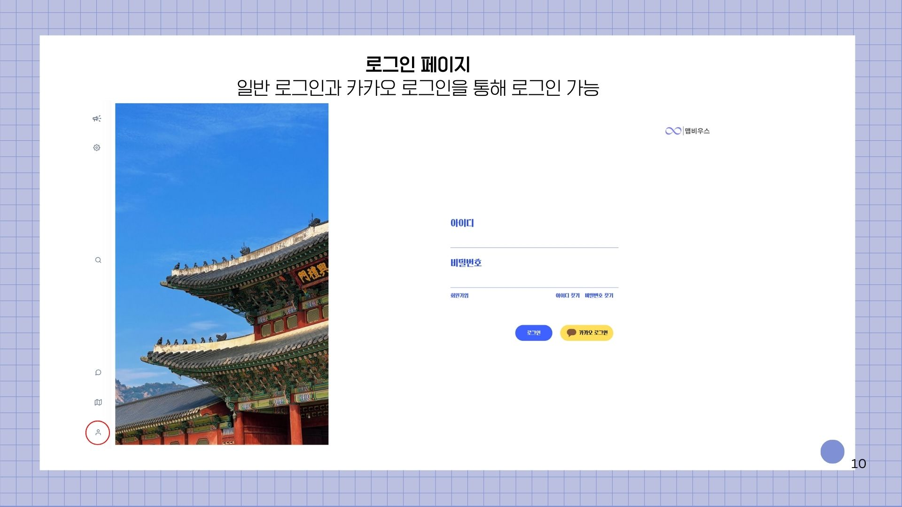
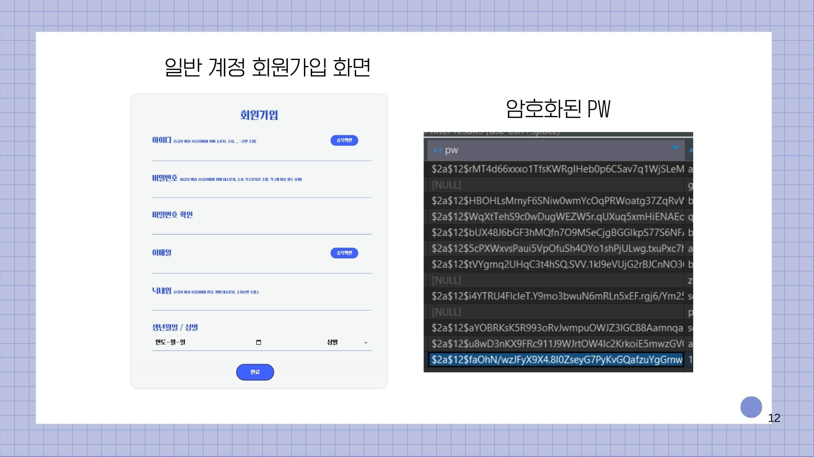
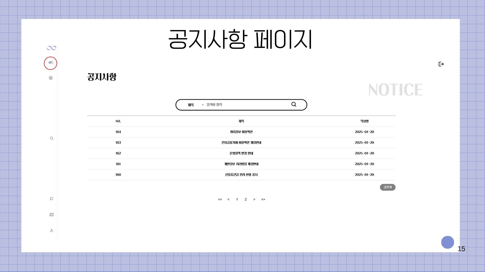
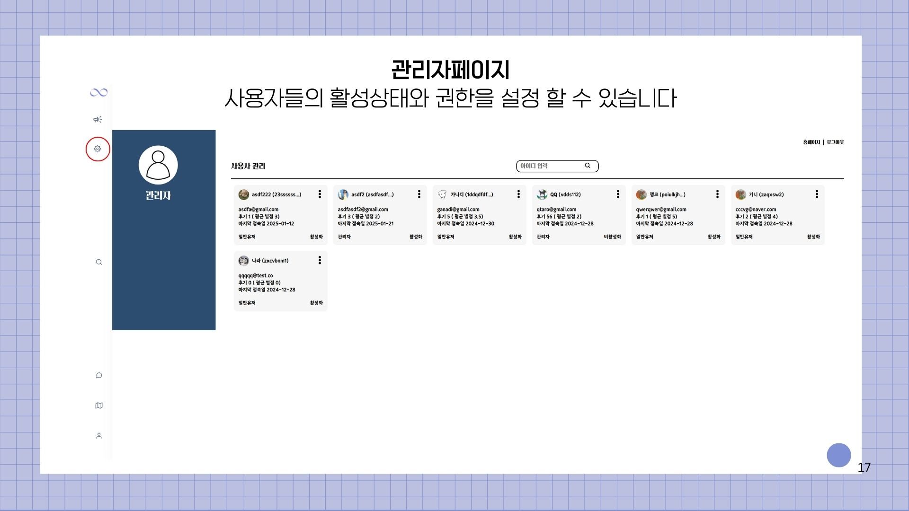
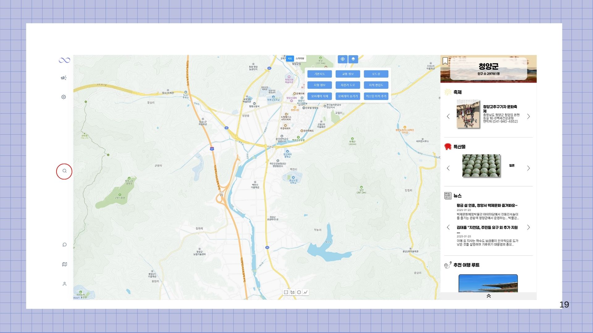
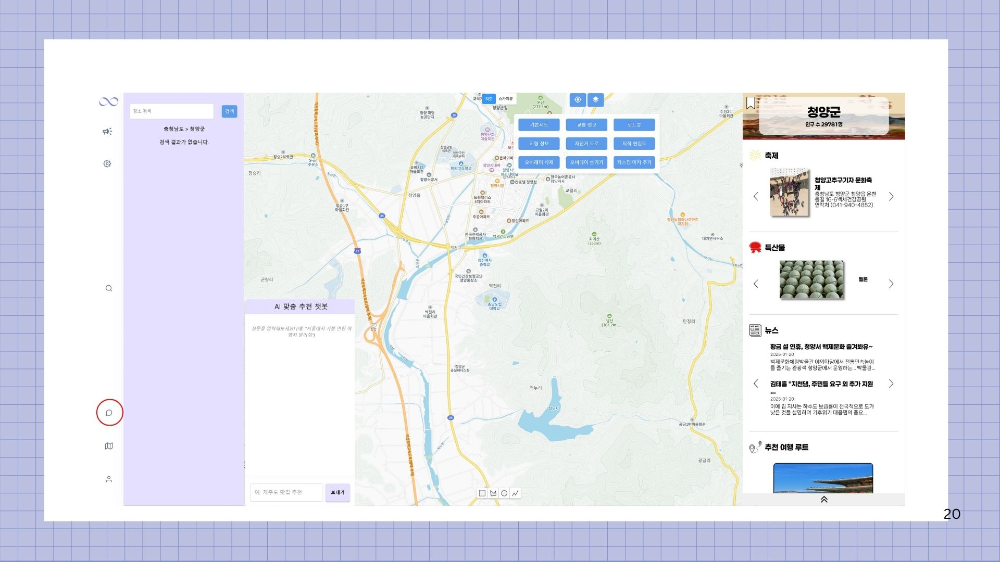
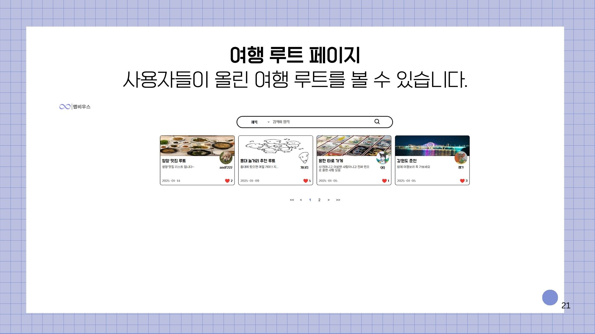
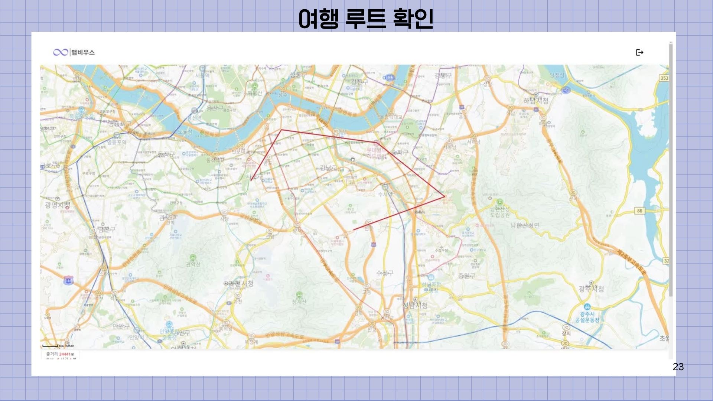
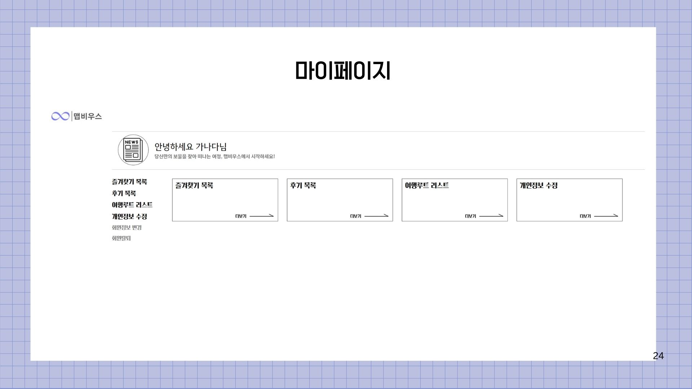
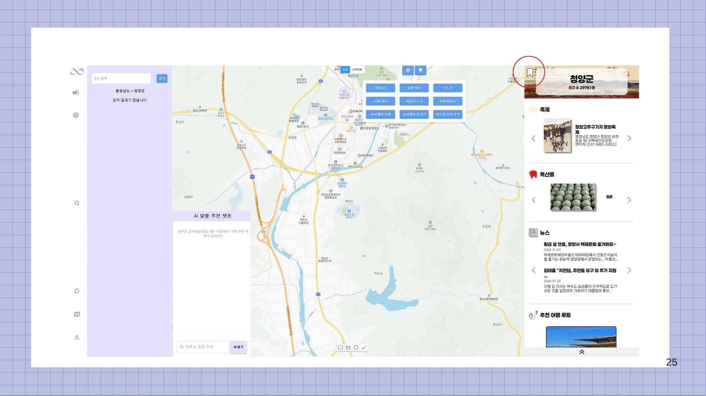
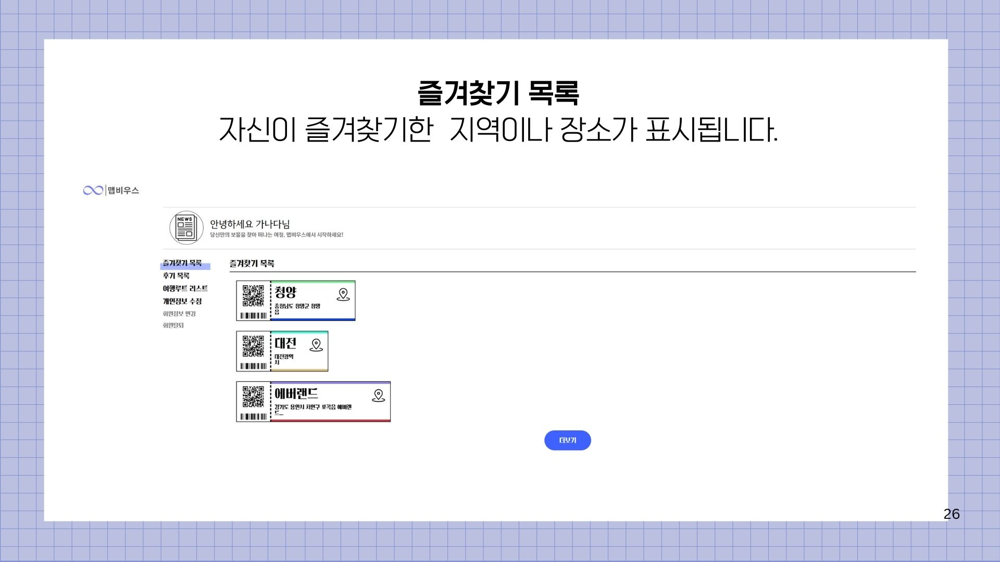
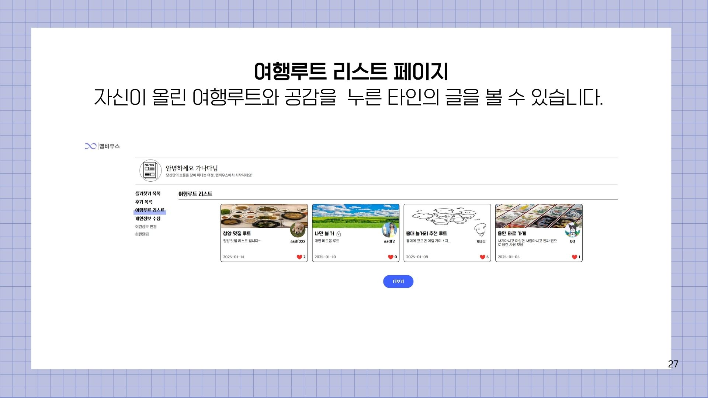
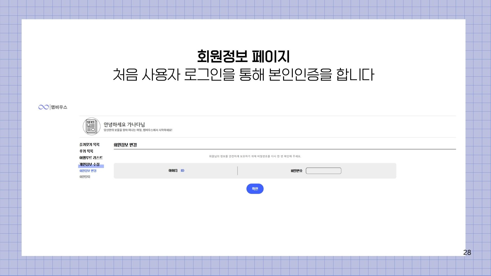
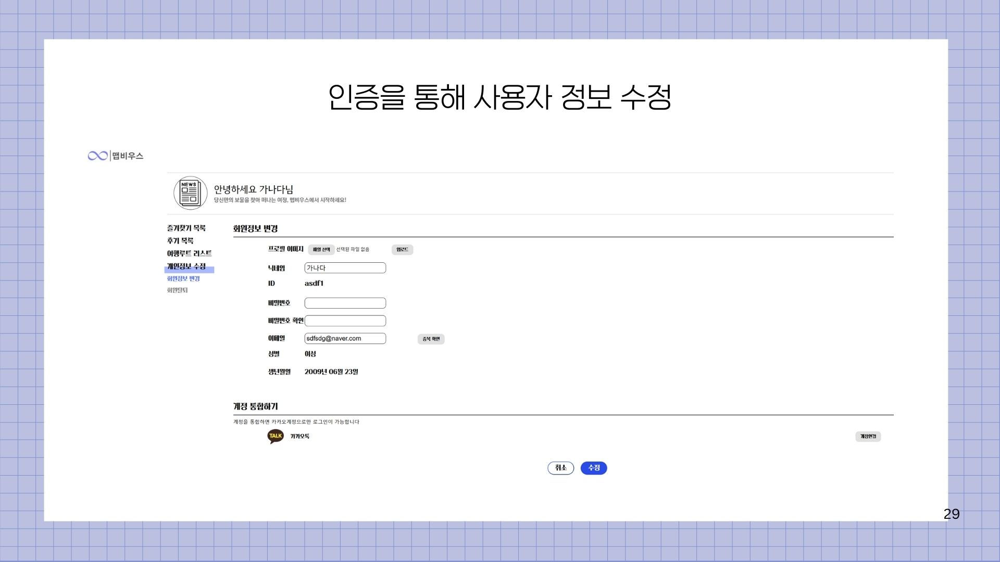
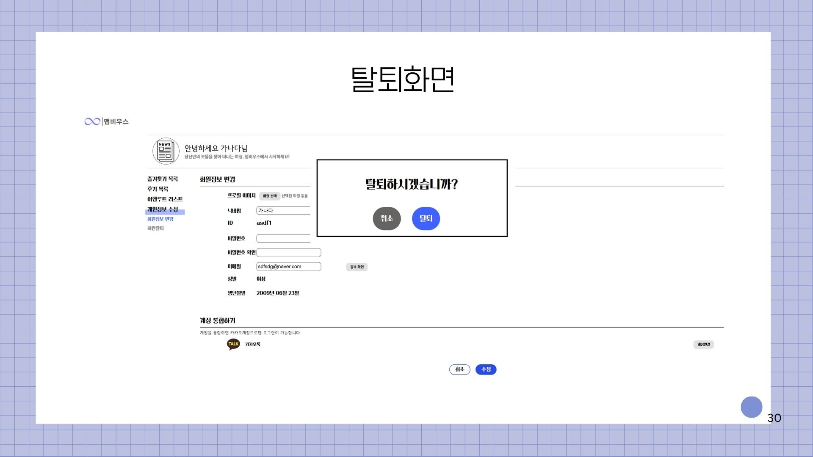